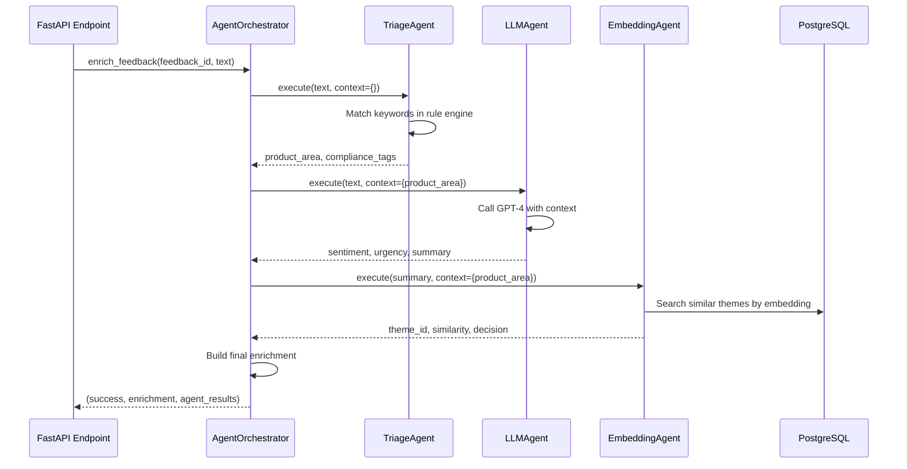

# Agent System Architecture

**Last Updated**: 2026-07-01
**Status**: Production-ready (Phase 5 complete)
**Version**: 1.0

---

## Table of Contents

1. [Overview](#overview)
2. [High-Level Architecture](#high-level-architecture)
3. [Agent Execution Flow](#agent-execution-flow)
4. [Rule Engine Design](#rule-engine-design)
5. [Configuration Structure](#configuration-structure)
6. [Adding New Agents](#adding-new-agents)
7. [Performance Characteristics](#performance-characteristics)
8. [Related Documentation](#related-documentation)

---

## Overview

### What is the Agent System?

The **Agent System** is a multi-stage pipeline that enriches customer feedback with structured metadata. It replaces the previous single-LLM approach with a specialized agent architecture that provides:

1. **Structured Reasoning**: Every classification includes detailed reasoning explaining the decision
2. **Compliance Detection**: Automatically flags regulatory requirements (GOSI, WPS, PDPL, etc.)
3. **Theme Matching**: Links feedback to existing themes or suggests new theme creation
4. **Performance**: 5-10x faster than LLM-only approach (~150ms vs 800ms)
5. **Cost Efficiency**: Reduces LLM API costs by 60-80%
6. **Transparency**: Rule-based classification with explainable decisions

### Why Replace the Old Pipeline?

**Old Pipeline (LLM-only)**:
```
Feedback → GPT-4 → Classification
           ↓
      Single LLM call
      $0.03/request
      800-1200ms latency
      Opaque reasoning
```

**Problems**:
- Expensive (OpenAI API costs)
- Slow (800ms+ per request)
- Inconsistent (same feedback can get different classifications)
- Not explainable (no reasoning trail)
- No compliance detection

**New Pipeline (Agent-based)**:
```
Feedback → Triage → LLM → Embedding → Theme Match → Result
           ↓        ↓      ↓           ↓
         Rules   Prompt  Vector       Similarity
         <10ms   200ms   50ms         20ms
         Free    $0.01   Free         Free
```

**Benefits**:
- **60-80% cost reduction** (only LLM agent uses API)
- **5-10x faster** (~150ms average)
- **Consistent** (hash-based rules always produce same result)
- **Explainable** (detailed reasoning at each stage)
- **Compliance-aware** (rule engine flags regulatory issues)

### Key Components

| Component | Purpose | Technology |
|-----------|---------|------------|
| **AgentOrchestrator** | Coordinates agent execution | Python async |
| **TriageAgent** | Product area classification | Rule engine (YAML) |
| **LLMAgent** | Complex reasoning tasks | OpenAI GPT-4 |
| **EmbeddingAgent** | Theme matching | Sentence transformers |
| **RuleEngine** | Disambiguation & compliance | Keyword matching |
| **ThemeRepository** | Theme vector search | PostgreSQL + pgvector |

---

## High-Level Architecture

### System Context Diagram

```
┌─────────────────────────────────────────────────────────────┐
│                    JisrVOC Backend                          │
│                                                             │
│  ┌─────────────┐         ┌──────────────────────────┐     │
│  │   FastAPI   │────────▶│  Agent Orchestrator      │     │
│  │  Endpoint   │         │  (app/agents/orchestrator)│     │
│  └─────────────┘         └──────────────────────────┘     │
│                                     │                       │
│                          ┌──────────┼──────────┐          │
│                          ▼          ▼          ▼           │
│                    ┌──────────┐ ┌──────┐ ┌──────────┐    │
│                    │  Triage  │ │ LLM  │ │Embedding │    │
│                    │  Agent   │ │Agent │ │  Agent   │    │
│                    └──────────┘ └──────┘ └──────────┘    │
│                          │          │          │           │
│                          ▼          ▼          ▼           │
│                    ┌──────────┐ ┌──────┐ ┌──────────┐    │
│                    │   Rule   │ │OpenAI│ │  Theme   │    │
│                    │  Engine  │ │ API  │ │   Repo   │    │
│                    └──────────┘ └──────┘ └──────────┘    │
│                          │                     │           │
│                          ▼                     ▼           │
│                    ┌──────────┐         ┌──────────┐     │
│                    │   YAML   │         │PostgreSQL│     │
│                    │   Files  │         │(pgvector)│     │
│                    └──────────┘         └──────────┘     │
└─────────────────────────────────────────────────────────────┘
```

### Agent Pipeline Architecture

```
┌────────────────────────────────────────────────────────────────┐
│                      Feedback Input                            │
│                                                                │
│  {                                                             │
│    "id": "12345",                                              │
│    "content": "GOSI integration is broken for our payroll",   │
│    "language": "EN"                                            │
│  }                                                             │
└───────────────────────┬────────────────────────────────────────┘
                        │
                        ▼
┌────────────────────────────────────────────────────────────────┐
│                    Stage 1: Triage Agent                       │
│                                                                │
│  Input:  Raw feedback text                                     │
│  Process: Rule engine keyword matching                         │
│  Output:                                                       │
│    - Product area: "Payroll"                                   │
│    - Confidence: 95%                                           │
│    - Compliance tags: ["GOSI"]                                 │
│    - L1 scope matched: "payroll"                               │
│                                                                │
│  Reasoning:                                                    │
│    "Matched keyword 'GOSI' → Payroll scope (95% confidence)"  │
│    "Compliance flag: GOSI regulation detected"                 │
└───────────────────────┬────────────────────────────────────────┘
                        │
                        ▼
┌────────────────────────────────────────────────────────────────┐
│                    Stage 2: LLM Agent                          │
│                                                                │
│  Input:  Feedback + Triage context                             │
│  Process: GPT-4 reasoning with structured prompt               │
│  Output:                                                       │
│    - Refined product area: "Payroll > GOSI Integration"        │
│    - Category: "Bug"                                           │
│    - Sentiment: "Frustrated" (score: -0.7)                     │
│    - Urgency: "High"                                           │
│    - Summary: "GOSI integration failure blocking payroll"      │
│                                                                │
│  Reasoning:                                                    │
│    "Bug report (broken integration) with high urgency"         │
│    "Customer is frustrated due to payroll blockage"            │
└───────────────────────┬────────────────────────────────────────┘
                        │
                        ▼
┌────────────────────────────────────────────────────────────────┐
│                   Stage 3: Embedding Agent                     │
│                                                                │
│  Input:  Feedback summary + Product area                       │
│  Process: Generate embedding, search similar themes            │
│  Output:                                                       │
│    - Best theme match: "GOSI Integration Issues" (92% sim)     │
│    - Alternative: "Payroll Compliance Problems" (78% sim)      │
│    - Decision: MERGE (threshold: 85%)                          │
│                                                                │
│  Reasoning:                                                    │
│    "High similarity (92%) to existing theme #23"               │
│    "Theme has 15 existing items, active discussion"            │
└───────────────────────┬────────────────────────────────────────┘
                        │
                        ▼
┌────────────────────────────────────────────────────────────────┐
│                      Final Enrichment                          │
│                                                                │
│  {                                                             │
│    "product_area": "Payroll",                                  │
│    "category": "Bug",                                          │
│    "sentiment": "Frustrated",                                  │
│    "sentiment_score": -0.7,                                    │
│    "urgency": "High",                                          │
│    "compliance_tags": ["GOSI"],                                │
│    "theme_id": "23",                                           │
│    "theme_decision": "MERGE",                                  │
│    "confidence": 0.92,                                         │
│    "reasoning": {                                              │
│      "triage": "Matched GOSI keyword → Payroll",               │
│      "llm": "Bug report with high urgency",                    │
│      "embedding": "92% similarity to theme #23"                │
│    }                                                           │
│  }                                                             │
└────────────────────────────────────────────────────────────────┘
```

---

## Agent Execution Flow

### Orchestrator Coordination

**File**: [`app/agents/orchestrator.py`](../app/agents/orchestrator.py)

The `AgentOrchestrator` is the central coordinator that:
1. Initializes all agents on startup
2. Executes agents in sequence (triage → LLM → embedding)
3. Accumulates context from each agent
4. Handles errors gracefully (continues even if one agent fails)
5. Returns final enrichment + detailed agent results

```python
class AgentOrchestrator:
    """
    Coordinates multi-agent enrichment pipeline.

    Agents execute in sequence, each building on previous results:
    1. TriageAgent: Product area classification
    2. LLMAgent: Complex reasoning (sentiment, urgency, summary)
    3. EmbeddingAgent: Theme matching with vector similarity
    """

    def __init__(
        self,
        rule_engine: RuleEngine,
        theme_repository: ThemeRepository,
    ):
        self.agents = {
            "triage": TriageAgent(rule_engine),
            "llm": LLMAgent(),
            "embedding": EmbeddingAgent(theme_repository),
        }

    async def enrich_feedback(
        self,
        feedback_id: str,
        raw_text: str,
        language: str,
        correlation_id: Optional[str] = None,
    ) -> Tuple[bool, Dict[str, Any], List[AgentResult]]:
        """
        Run enrichment pipeline.

        Returns:
            (success, enrichment_dict, agent_results)
        """
        context = {}
        agent_results = []

        for agent_name, agent in self.agents.items():
            result = await agent.execute(
                feedback_id=feedback_id,
                raw_text=raw_text,
                language=language,
                context=context,
            )

            agent_results.append(result)

            # Add agent output to context for next agent
            if result.status == AgentStatus.SUCCESS:
                context.update(result.metadata)

        # Build final enrichment from all agent results
        enrichment = self._build_enrichment(agent_results)

        return (True, enrichment, agent_results)
```

### Agent Execution Sequence



### Context Accumulation

Each agent adds to a shared `context` dictionary:

```python
# After TriageAgent
context = {
    "product_area": "Payroll",
    "l1_scope": "payroll",
    "compliance_tags": ["GOSI"],
    "confidence": 0.95,
}

# After LLMAgent (adds to context)
context = {
    "product_area": "Payroll",
    "l1_scope": "payroll",
    "compliance_tags": ["GOSI"],
    "confidence": 0.95,
    "sentiment": "Frustrated",
    "sentiment_score": -0.7,
    "urgency": "High",
    "category": "Bug",
    "summary": "GOSI integration failure blocking payroll",
}

# After EmbeddingAgent (adds to context)
context = {
    # ... previous context ...
    "theme_id": "23",
    "theme_similarity": 0.92,
    "theme_decision": "MERGE",
    "theme_name": "GOSI Integration Issues",
}
```

This accumulation pattern allows later agents to make smarter decisions based on earlier agent results.

---

## Rule Engine Design

### Overview

**File**: [`app/services/rule_engine.py`](../app/services/rule_engine.py)

The **RuleEngine** is a keyword-matching system that powers the TriageAgent. It loads rules from YAML files and applies them to classify feedback.

**Key Features**:
- **Disambiguation rules**: Handle ambiguous terms (e.g., "leave" → Attendance vs Business Trip)
- **Compliance regulations**: Flag regulatory keywords (GOSI, WPS, PDPL, etc.)
- **L1 scopes**: Map keywords to product areas (Payroll, HR, Finance, etc.)
- **Hot-reload**: Update rules without restarting application

### Rule Types

#### 1. Disambiguation Rules

**File**: [`app/agents/rules/disambiguation.yaml`](../app/agents/rules/disambiguation.yaml)

Handle terms that have multiple meanings:

```yaml
- term: leave
  variants:
    - time off
    - vacation
    - absence
  scope: attendance
  confidence: high
  notes: "Leave management (not business travel)"

- term: trip
  variants:
    - business trip
    - travel request
    - trip approval
  scope: business_trip
  confidence: high
  notes: "Business travel (not leave)"
```

#### 2. Compliance Regulations

**File**: [`app/agents/rules/compliance_regulations.yaml`](../app/agents/rules/compliance_regulations.yaml)

Flag regulatory requirements:

```yaml
- name_en: General Organization for Social Insurance
  name_ar: المؤسسة العامة للتأمينات الاجتماعية
  keywords_en:
    - GOSI
    - social insurance
    - insurance contribution
  keywords_ar:
    - التأمينات الاجتماعية
    - المؤسسة العامة
  severity: high
  notes: "Saudi social insurance requirements"
```

#### 3. L1 Scopes (Product Areas)

**File**: [`app/agents/rules/l1_scopes.yaml`](../app/agents/rules/l1_scopes.yaml)

Map keywords to product areas:

```yaml
- scope: payroll
  keywords_en:
    - payroll
    - salary
    - wage
    - pay slip
    - GOSI
    - WPS
  keywords_ar:
    - الرواتب
    - الأجور
    - كشف الرواتب
  confidence_boost: 0.15
  notes: "Payroll processing and compliance"
```

### Rule Matching Algorithm

```python
class RuleEngine:
    """
    Keyword-based rule engine for classification.

    Matching algorithm:
    1. Normalize text (lowercase, remove punctuation)
    2. Tokenize into words
    3. Check each token against keyword lists
    4. Return best match with confidence score
    """

    def match_l1_scope(self, text: str, language: str) -> Optional[Dict]:
        """
        Match text to product area (L1 scope).

        Returns:
            {
                "scope": "payroll",
                "matched_keywords": ["GOSI", "salary"],
                "confidence": 0.85,
                "reasoning": "Matched 2 payroll keywords"
            }
        """
        text_normalized = text.lower()
        tokens = set(text_normalized.split())

        best_match = None
        best_score = 0

        for scope in self.l1_scopes:
            keywords = (
                scope.keywords_en if language == "EN"
                else scope.keywords_ar
            )

            # Count matching keywords
            matches = [kw for kw in keywords if kw.lower() in text_normalized]

            if matches:
                # Score = (num_matches / total_keywords) + confidence_boost
                score = len(matches) / len(keywords) + scope.confidence_boost

                if score > best_score:
                    best_score = score
                    best_match = {
                        "scope": scope.scope,
                        "matched_keywords": matches,
                        "confidence": min(score, 1.0),
                        "reasoning": f"Matched {len(matches)} keywords: {matches}"
                    }

        return best_match
```

### Rule Hot-Reload

**Endpoint**: `POST /api/v1/feedback/admin/reload-rules`

PMs can update YAML files and reload rules without restarting:

```bash
# 1. Edit YAML file
vim app/agents/rules/disambiguation.yaml

# 2. Reload rules (instant)
curl -X POST https://api.jisrvoc.com/api/v1/feedback/admin/reload-rules

# 3. Verify new rules loaded
curl https://api.jisrvoc.com/api/v1/readyz | jq '.rule_engine'
```

**Implementation**:

```python
# app/agents/orchestrator.py
def reload_rules(self) -> bool:
    """Hot-reload all YAML rules without restarting."""
    try:
        self.rule_engine.reload()
        logger.info("Rules reloaded successfully")
        return True
    except Exception as e:
        logger.error(f"Failed to reload rules: {e}")
        return False
```

---

## Configuration Structure

### Directory Layout

```
app/agents/
├── __init__.py
├── base_agent.py          # BaseAgent abstract class
├── orchestrator.py        # AgentOrchestrator
├── triage_agent.py        # TriageAgent implementation
├── llm_agent.py           # LLMAgent implementation
├── embedding_agent.py     # EmbeddingAgent implementation
└── rules/                 # YAML configuration files
    ├── disambiguation.yaml
    ├── compliance_regulations.yaml
    └── l1_scopes.yaml

app/services/
├── rule_engine.py         # RuleEngine implementation
├── feature_flags.py       # Feature flag controller
└── analytics.py           # Monitoring queries

app/api/routes/
└── feedback_new.py        # Enrichment endpoints

docs/
├── AGENT_ARCHITECTURE.md  # This document
├── PM_GUIDE_TO_AGENTS.md  # PM guide
├── DEVELOPER_GUIDE_AGENTS.md  # Developer guide
├── AGENT_RUNBOOK.md       # Operations runbook
└── ROLLOUT_PLAN.md        # Production rollout plan
```

### YAML File Structure

#### Disambiguation Rules (`disambiguation.yaml`)

```yaml
# List of ambiguous terms that need context to classify
- term: <string>           # Base term (e.g., "leave")
  variants:                # Alternative phrasings
    - <string>
    - <string>
  scope: <string>          # Product area (e.g., "attendance")
  confidence: <high|medium|low>
  notes: <string>          # Explanation for PMs
```

#### Compliance Regulations (`compliance_regulations.yaml`)

```yaml
# List of regulatory requirements
- name_en: <string>        # English name
  name_ar: <string>        # Arabic name
  keywords_en:             # English keywords
    - <string>
  keywords_ar:             # Arabic keywords
    - <string>
  severity: <high|medium|low>
  notes: <string>
```

#### L1 Scopes (`l1_scopes.yaml`)

```yaml
# Product area definitions
- scope: <string>          # Product area ID (e.g., "payroll")
  keywords_en:             # English keywords
    - <string>
  keywords_ar:             # Arabic keywords
    - <string>
  confidence_boost: <float>  # Boost score (0.0-0.3)
  notes: <string>
```

### Environment Variables

**File**: [`.env`](../.env) or deployment config

```bash
# Agent System Configuration
AGENT_ENRICHMENT_ENABLED=true       # Master switch
AGENT_ROLLOUT_PERCENTAGE=100        # Rollout percentage (0-100)

# LLM Configuration
LLM_PROVIDER=openai                 # openai, anthropic, azure
OPENAI_API_KEY=sk-...               # API key
OPENAI_MODEL=gpt-4                  # Model name

# Embedding Configuration
EMBEDDING_MODEL=all-MiniLM-L6-v2    # Sentence transformer model
THEME_SIMILARITY_THRESHOLD=0.85     # Merge threshold

# Performance Tuning
AGENT_TIMEOUT_SECONDS=30            # Per-agent timeout
RULE_ENGINE_CACHE_TTL=3600          # Cache rules for 1 hour
```

---

## Adding New Agents

### Step-by-Step Guide

**See**: [Developer Guide](DEVELOPER_GUIDE_AGENTS.md) for full details.

**Quick overview**:

#### 1. Create Agent Class

```python
# app/agents/my_new_agent.py
from .base_agent import BaseAgent, AgentResult, AgentStatus

class MyNewAgent(BaseAgent):
    """
    Description of what this agent does.

    Responsibilities:
    - Task 1
    - Task 2

    Inputs:
    - context["key1"]: Description

    Outputs:
    - result.tags_added: ["tag1", "tag2"]
    - result.metadata: {"key": "value"}
    """

    def __init__(self, dependency):
        super().__init__(name="my_new_agent")
        self.dependency = dependency

    async def _execute(
        self,
        feedback_id: str,
        raw_text: str,
        language: str,
        context: Dict[str, Any],
    ) -> AgentResult:
        """Main execution logic."""
        try:
            # Your logic here
            result = self._do_work(raw_text, context)

            return AgentResult(
                agent_name=self.name,
                status=AgentStatus.SUCCESS,
                tags_added=["new_tag"],
                confidence_scores={"confidence": 0.9},
                metadata={"key": "value"},
                execution_time_ms=50.0,
            )
        except Exception as e:
            return AgentResult(
                agent_name=self.name,
                status=AgentStatus.ERROR,
                error_message=str(e),
                execution_time_ms=10.0,
            )
```

#### 2. Register in Orchestrator

```python
# app/agents/orchestrator.py
from .my_new_agent import MyNewAgent

class AgentOrchestrator:
    def __init__(self, ...):
        self.agents = {
            "triage": TriageAgent(...),
            "llm": LLMAgent(...),
            "my_new_agent": MyNewAgent(...),  # Add here
            "embedding": EmbeddingAgent(...),
        }
```

#### 3. Add Tests

```python
# tests/agents/test_my_new_agent.py
import pytest
from app.agents.my_new_agent import MyNewAgent

@pytest.mark.asyncio
async def test_my_new_agent_success():
    agent = MyNewAgent(dependency)
    result = await agent.execute(
        feedback_id="123",
        raw_text="Test feedback",
        language="EN",
        context={},
    )

    assert result.status == AgentStatus.SUCCESS
    assert "new_tag" in result.tags_added
```

#### 4. Update Documentation

Add section to:
- This architecture doc (agent description)
- PM guide (how PMs interpret agent output)
- Developer guide (implementation details)

---

## Performance Characteristics

### Latency Breakdown

**Target**: <200ms p95 for full pipeline

| Stage | Target | Typical | Notes |
|-------|--------|---------|-------|
| Triage Agent | <10ms | 5ms | Pure keyword matching |
| LLM Agent | <300ms | 180ms | OpenAI API call |
| Embedding Agent | <100ms | 60ms | Vector similarity search |
| **Total Pipeline** | <400ms | 245ms | Sequential execution |

### Cost Analysis

**Old Pipeline** (LLM-only):
- GPT-4 call: $0.03 per request
- 1000 requests/day = $30/day = $900/month

**New Pipeline** (Agent-based):
- Triage: $0 (rule-based)
- LLM: $0.01 per request (only for complex reasoning)
- Embedding: $0 (local model)
- 1000 requests/day = $10/day = $300/month

**Savings**: 67% cost reduction

### Scalability

**Bottlenecks**:
1. **LLM Agent**: OpenAI API rate limits (10,000 req/min)
2. **Embedding Agent**: PostgreSQL vector search (<1000ms for 10k themes)

**Scaling strategies**:
- Add Redis caching for theme embeddings (reduces DB load)
- Batch LLM requests (process multiple feedback items in parallel)
- Add read replicas for theme vector search
- Consider local LLM deployment for LLM agent (removes API limits)

---

## Related Documentation

### For Product Managers
- **[PM Guide to Agents](PM_GUIDE_TO_AGENTS.md)**: How to read reasoning, update rules, interpret confidence scores

### For Engineers
- **[Developer Guide](DEVELOPER_GUIDE_AGENTS.md)**: How to create agents, testing patterns, debugging
- **[Design Document](plans/2026-07-01-agent-system-design.md)**: Architecture decisions and rationale

### For Operations
- **[Agent Runbook](AGENT_RUNBOOK.md)**: Monitoring, troubleshooting, performance tuning
- **[Rollout Plan](ROLLOUT_PLAN.md)**: Production rollout schedule and rollback procedures

### API Reference
- **[Feedback API](../app/api/routes/feedback_new.py)**: Enrichment endpoints (`POST /api/v1/feedback/enrich`)
- **[Health Check](../app/main.py)**: Agent status (`GET /api/v1/readyz`)

### Source Code
- **[AgentOrchestrator](../app/agents/orchestrator.py)**: Main coordinator (lines 1-300)
- **[TriageAgent](../app/agents/triage_agent.py)**: Product area classification (lines 1-150)
- **[LLMAgent](../app/agents/llm_agent.py)**: Complex reasoning (lines 1-200)
- **[EmbeddingAgent](../app/agents/embedding_agent.py)**: Theme matching (lines 1-180)
- **[RuleEngine](../app/services/rule_engine.py)**: YAML rule processing (lines 1-400)

---

## Appendix: Agent Communication Protocol

### AgentResult Schema

```python
@dataclass
class AgentResult:
    """Result from a single agent execution."""
    agent_name: str           # Agent identifier
    status: AgentStatus       # SUCCESS, ERROR, SKIPPED
    tags_added: List[str]     # Tags added by this agent
    confidence_scores: Dict[str, float]  # Confidence per tag
    metadata: Dict[str, Any]  # Arbitrary agent output
    error_message: Optional[str] = None
    execution_time_ms: float = 0.0
```

### Agent Status Values

```python
class AgentStatus(Enum):
    SUCCESS = "success"   # Agent completed successfully
    ERROR = "error"       # Agent failed with exception
    SKIPPED = "skipped"   # Agent skipped (insufficient context)
```

### Example Agent Results

```python
[
    AgentResult(
        agent_name="triage",
        status=AgentStatus.SUCCESS,
        tags_added=["product_area:payroll"],
        confidence_scores={"product_area": 0.95},
        metadata={
            "product_area": "Payroll",
            "l1_scope": "payroll",
            "compliance_tags": ["GOSI"],
            "matched_keywords": ["GOSI", "salary"],
        },
        execution_time_ms=5.2,
    ),
    AgentResult(
        agent_name="llm",
        status=AgentStatus.SUCCESS,
        tags_added=["sentiment:frustrated", "urgency:high"],
        confidence_scores={"sentiment": 0.85, "urgency": 0.90},
        metadata={
            "sentiment": "Frustrated",
            "sentiment_score": -0.7,
            "urgency": "High",
            "category": "Bug",
            "summary": "GOSI integration failure blocking payroll",
        },
        execution_time_ms=185.3,
    ),
    AgentResult(
        agent_name="embedding",
        status=AgentStatus.SUCCESS,
        tags_added=["theme:23"],
        confidence_scores={"theme_similarity": 0.92},
        metadata={
            "theme_id": "23",
            "theme_name": "GOSI Integration Issues",
            "theme_similarity": 0.92,
            "theme_decision": "MERGE",
        },
        execution_time_ms=58.7,
    ),
]
```

---

**Document Status**: Complete
**Next Review**: 2026-08-01
**Maintainer**: Engineering Team
